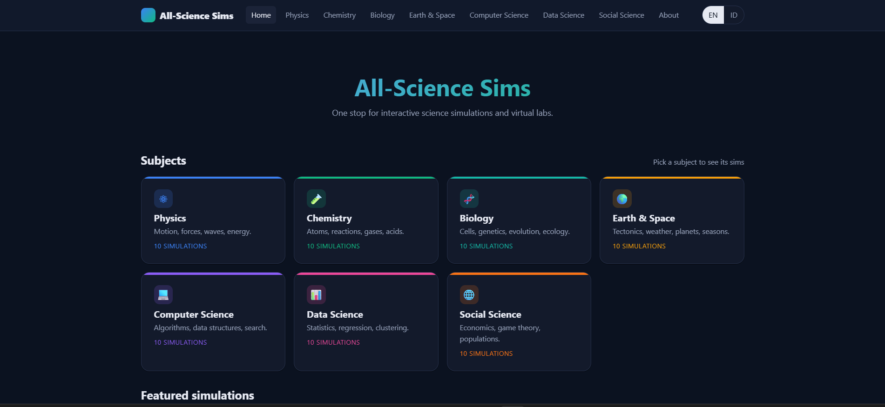
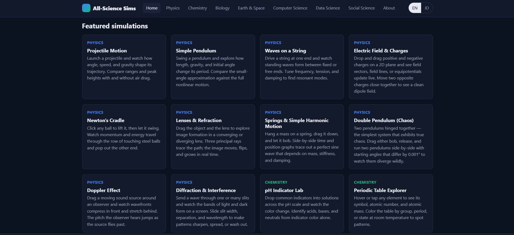
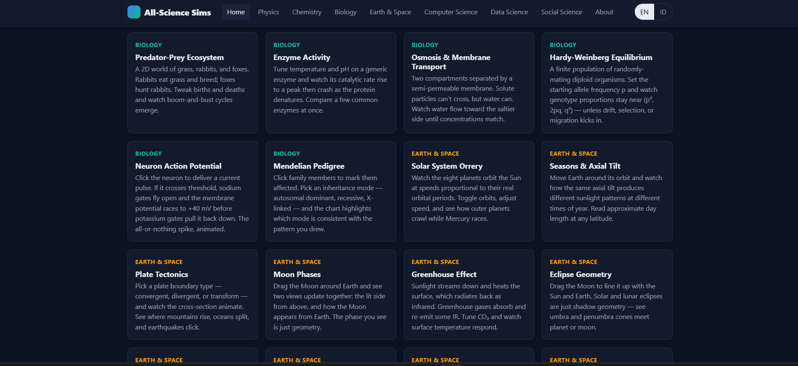
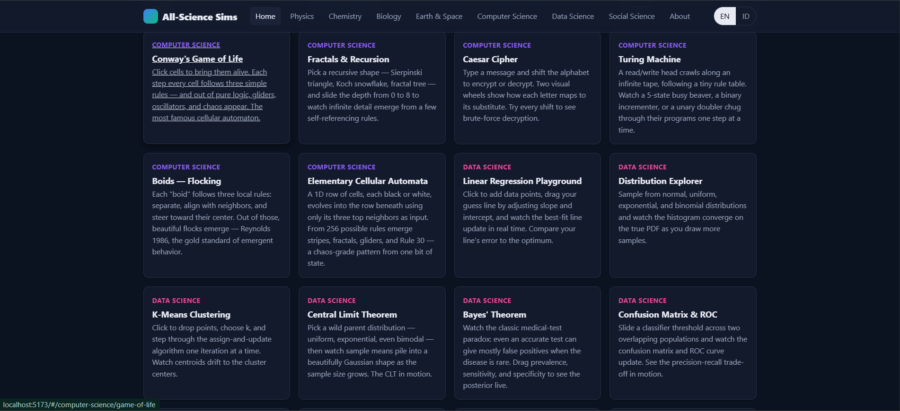
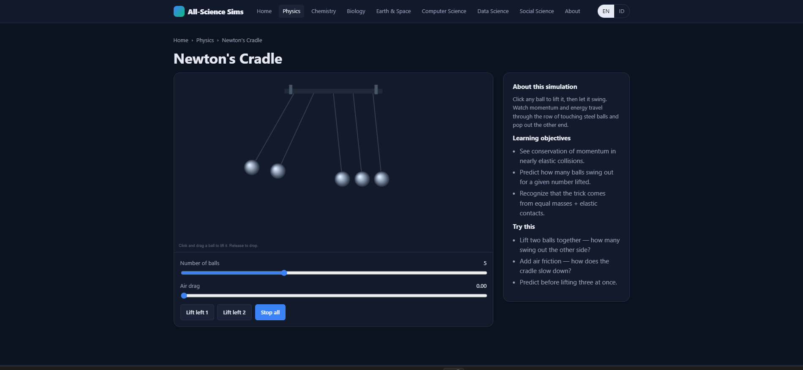
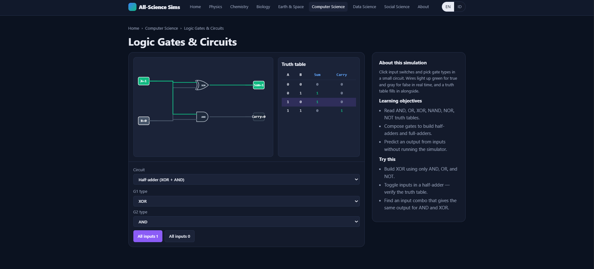
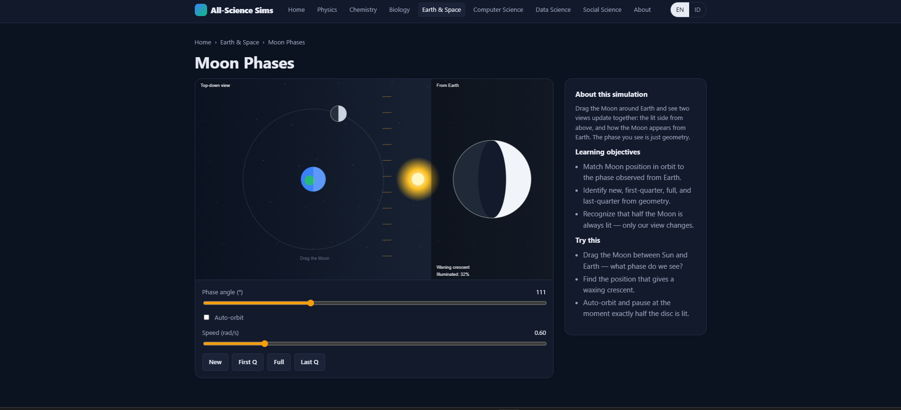
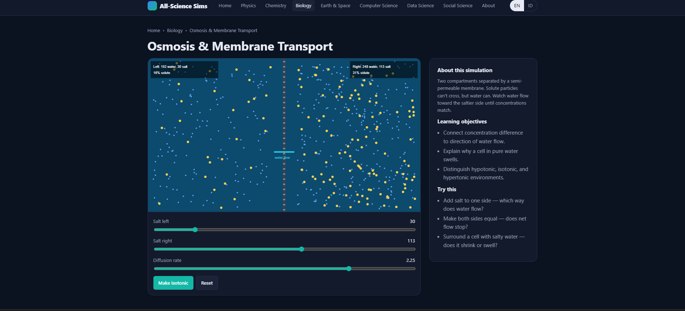

# All-Science Sims

> One stop for interactive science simulations and virtual labs.
> 126 hand-built sims across 9 subjects · runs entirely in your browser · bilingual (English / Bahasa Indonesia) · free and open source.

A client-side hub of original interactive simulations covering **physics, chemistry, biology, earth & space, computer science, data science, social science, mathematics, and finance & economics**. No backend, no tracking, no install — just open the page and start clicking, dragging, and learning. Useful for students, teachers, self-learners, tutors, and anyone curious about science.

See [CHANGELOG.md](CHANGELOG.md) for what's new in each release.

---

## Features

- **126 original simulations** across 9 subjects — see [Catalog](#catalog) below.
- **Direct manipulation everywhere** — drag charges, drag the pendulum bob, drag data points, draw walls in the maze, click switches in a logic circuit, and so on.
- **Bilingual UI**: every sim has English and Bahasa Indonesia text. Toggle in the header; preference is saved to `localStorage`.
- **Fully client-side** — no servers, no APIs, no analytics. Loads fast, works offline once cached, runs from `file://` if you want.
- **Lazy-loaded sims** — the home page is ~20 KB gzipped; each sim downloads only when opened.
- **Hash-based routing** — the same `dist/` folder works on GitHub Pages, Netlify, Vercel, S3, your own server, or a USB stick.
- **Responsive + dark-mode aware** — adapts to your OS theme via `prefers-color-scheme`.
- **Reduced-motion respect** — non-essential animations slow down for `prefers-reduced-motion: reduce`.

---

## Screenshots

**Home page** — pick a subject from the grid, or scroll down for featured sims.



**Featured simulations** — every sim is one click away from the front page.



**Subject pages** — each subject collects its 10 sims in one place.

| Biology · Earth & Space | Computer Science |
|:---:|:---:|
|  |  |

**Sim pages** — every sim has the same layout: interactive stage on the left, intro / objectives / "try this" prompts on the right.

| Newton's Cradle (Physics) | Logic Gates & Circuits (CS) |
|:---:|:---:|
|  |  |

| Moon Phases (Earth & Space) | Osmosis & Membrane Transport (Biology) |
|:---:|:---:|
|  |  |

---

## Catalog

### Physics

| Sim | What you do |
|---|---|
| Projectile Motion | Click anywhere on the field to aim the launcher. Adjust angle, speed, gravity, and air drag; compare ranges with ghost trails. |
| Simple Pendulum | Grab and drag the bob to set the initial angle. Compare measured period vs. small-angle prediction. |
| Waves on a String | Drive a string at one end, choose fixed/free far end, find resonant frequencies. |
| Electric Field & Charges | Drop, drag, and right-click charges. Toggle field lines, vector grid, or potential heatmap. |
| Newton's Cradle | Click and lift any of N balls, release, watch momentum cascade through the row. |
| Lenses & Refraction | Drag the object along the axis; three principal rays trace image formation in a converging or diverging lens. |
| Springs & SHM | Hang a mass on a spring, drag and release; side-by-side time/position graph shows perfect sine motion. |
| Double Pendulum (chaos) | Two pendulums hinged together — drag a bob, release, watch a "ghost" pendulum perturbed by 0.001° diverge wildly. |
| Doppler Effect | Drag a moving sound source past an observer; wavefronts bunch in front and stretch behind, plus a Mach cone above the speed of sound. |
| Diffraction & Interference | 1–8 slits, slide width / spacing / wavelength; intensity profile and screen pattern update live. |
| Buoyancy & Archimedes | Drop blocks of any density into water, oil, mercury, glycerin; the submerged fraction equals density ratio. |
| Orbital Mechanics (Kepler) | Click to place a planet, drag to set velocity, release; circular, elliptical, or escape trajectories emerge. |
| RLC Circuit Resonance | Series RLC schematic with animated current; current-vs-frequency curve peaks sharply at f₀ = 1/(2π√(LC)). |
| 1D Collisions | Two carts with adjustable masses and velocities; tune restitution from elastic to perfectly sticky. |
| Carnot Heat Engine | P-V diagram with two isotherms + two adiabats; efficiency η = 1 − T_c / T_h. |

### Chemistry

| Sim | What you do |
|---|---|
| pH Indicator Lab | Pick an indicator and a pH preset (lemon juice, vinegar, soap…) and see the beaker color flip. |
| Periodic Table Explorer | Hover any of the 118 elements; color the table by category, state at 25 °C, or period. |
| Ideal Gas Law | Tune n, T, and V; watch particles bounce while pressure (collision rate) responds as PV = nRT predicts. |
| Acid-Base Titration | Drip NaOH into strong or weak acid; the pH curve traces out and the indicator color changes in real time. |
| Bohr Atom Model | Slide atomic number Z; electrons fill 2-8-8-18 shells around the nucleus, valence highlighted. |
| Le Chatelier's Principle | Pick a reversible reaction (Haber, Contact, generic), then perturb T, P, or reagents and watch equilibrium shift. |
| Solubility & Saturation | Spoon solute into water; up to a temperature-dependent limit it dissolves, then deposits at the bottom. |
| VSEPR Molecular Geometry | Pick bonded atoms + lone pairs; the 3D shape rearranges (linear, tetrahedral, trigonal bipyramid, octahedral, plus presets like H₂O, NH₃, SF₆). |
| Phase Diagram (Water) | Drag a marker on the P-T plane; sample becomes solid / liquid / gas / supercritical with triple and critical points marked. |
| Beer-Lambert Spectroscopy | Slide concentration, path length, and wavelength; live transmittance, full absorbance spectrum, and a tunable lamp-cuvette-detector. |
| Collision Theory & Reaction Rates | Two species bouncing in a box; only collisions above Eₐ react. Rate responds to T, [A], [B], and a "catalyst" button. |
| Radioactive Decay & Half-Life | A grid of unstable atoms; each frame each one has a tiny chance to decay. Watch population halve every T₁⁄₂. |
| Aufbau Principle | Slide Z; electrons fill orbitals 1s, 2s, 2p, 3s, 3p, 4s, 3d… following Aufbau, Hund, Pauli; box diagram + configuration string. |
| Galvanic Cell | Pick two metal electrodes; cell voltage and electron-flow direction emerge from standard reduction potentials. |

### Biology

| Sim | What you do |
|---|---|
| Punnett Square | Cross monohybrid (Aa × Aa) and dihybrid (AaBb × AaBb) parents; ratios fill in automatically. |
| Cell Explorer | Click any organelle in an animal or plant cell to see what it does. |
| Natural Selection | Color-camouflaged prey reproduce on a colored background; the population shifts toward camouflaging hues. |
| DNA Transcription & Translation | Type any DNA, watch RNA polymerase + ribosome walk it base-by-base into a polypeptide. |
| Predator-Prey Ecosystem | 2D world of grass, rabbits, foxes — boom-and-bust population cycles emerge. |
| Enzyme Activity | Tune T and pH on pepsin, trypsin, amylase, catalase; activity curves shift; denaturation past 55 °C. |
| Osmosis & Membrane Transport | Two compartments, semi-permeable membrane — water flows toward the saltier side. |
| Hardy-Weinberg Equilibrium | Diploid population, set N and p; observe drift in small populations and selection shifting allele frequency. |
| Neuron Action Potential | Click the neuron to fire a pulse; FitzHugh-Nagumo dynamics show threshold, depolarization, refractory period. |
| Mendelian Pedigree | 3-generation family chart; click anyone to mark affected, and the panel says which inheritance modes are consistent. |
| Photosynthesis Rate | Tune light, CO₂, and temperature; bubbles of O₂ rise from a virtual leaf at the rate set by the limiting factor. |
| ECG / Heart Rhythm | Live P-QRS-T trace with a beating schematic heart; presets for resting, sleep, sprint, bradycardia, missed beats. |
| Mitosis Stages | Step or auto-play through interphase → prophase → metaphase → anaphase → telophase → cytokinesis. |
| DNA Replication | Replication fork unzips template; leading strand smooth, lagging strand built in Okazaki fragments. |

### Earth & Space

| Sim | What you do |
|---|---|
| Solar System Orrery | Watch the eight planets orbit at speeds proportional to real periods. |
| Seasons & Axial Tilt | Move Earth around its orbit; read day length at any latitude on any date. |
| Plate Tectonics | Pick convergent / divergent / transform; the cross-section animates with earthquakes. |
| Moon Phases | Drag the Moon around Earth; top-down and from-Earth views update together. |
| Greenhouse Effect | Tune CO₂ ppm; visible photons stream down, IR photons bounce off the GHG layer; surface temperature responds. |
| Eclipse Geometry | Drag Moon and Earth to create solar or lunar eclipses; umbra and penumbra cones rendered live. |
| Tides | Drag Moon (and Sun) around Earth; two tidal bulges form along the Moon-Earth line; spring vs neap tides labeled. |
| Coriolis Effect | Throw a ball across a spinning disk; switch between rotating-frame view (curved path) and inertial view (straight line). |
| Hertzsprung-Russell Diagram | Slide initial mass and life stage; star moves through main sequence → giant → white dwarf or supernova on the HR plot. |
| Mantle Convection | 2D slice of Earth's mantle; click to add heat or cold, watch convection cells rearrange and surface plates drift. |
| Hydrologic Cycle | Particle-based water cycle — evaporation, clouds, rain, runoff. Solar slider speeds up or stalls the loop. |
| Atmospheric Layers | Drag a probe from sea level to 500 km; T, P, ρ update live. Landmark presets (Everest, ozone, ISS, auroras). |
| Black Hole Gravitational Lens | Drag a star behind a black hole; lensed images appear on either side, snap to a perfect Einstein ring when aligned. |
| Hohmann Transfer Orbit | Two-burn fuel-optimal transfer between circular orbits; presets for Earth→Mars, Venus, Jupiter, LEO→GEO. |

### Computer Science

| Sim | What you do |
|---|---|
| Sorting Visualizer | Race bubble, insertion, selection, merge, quicksort on the same array. |
| Binary Search Tree | Insert / search / delete; compare sorted vs. balanced insertion shapes. |
| Pathfinding | Drag walls, start, and goal; race BFS against A*. |
| Logic Gates & Circuits | Toggle inputs, swap gate types, build half-adders and full-adders; truth table fills in alongside. |
| Conway's Game of Life | Click cells alive, run the B3/S23 rules, drop in glider/blinker/pulsar presets. |
| Fractals & Recursion | Sierpinski triangle, Koch snowflake, fractal tree, Cantor set — slide the depth from 0 to 8. |
| Caesar Cipher | Type plaintext, slide the shift, see ciphertext + a brute-force table of all 25 shifts. |
| Turing Machine | Pick busy beaver / binary inc / unary doubler; tape, head, state, and rule table all step in lockstep. |
| Boids — Flocking | Reynolds 1986 — three local rules (separate, align, cohese) produce emergent flocking; click to scatter. |
| Elementary Cellular Automata | Wolfram's 1D rules 0–255 (try 30, 90, 110, 184); rule lookup table rendered as 8 mini-patterns. |
| Reaction-Diffusion (Gray-Scott) | Two virtual chemicals on a grid; presets for spots, coral, maze, mitosis, worms — Turing patterns from a PDE. |
| Maze Generation | DFS, Prim's, Wilson's algorithms each carve a maze cell-by-cell with their own visual signature. |
| Genetic Algorithm | Type a target sentence; a population of random strings evolves via selection, crossover, and mutation. |
| Hash Tables & Collisions | Insert keys, watch buckets fill; switch chaining vs linear probing; load factor → expected lookup. |
| Big-O Comparison | O(1), log n, n, n log n, n², 2ⁿ, n! plotted side by side; live values at chosen n; toggle log scale. |

### Data Science

| Sim | What you do |
|---|---|
| Linear Regression Playground | Drag points, drag your best-guess line, compare your error against the least-squares optimum. |
| Distribution Explorer | Sample from normal / uniform / exponential / binomial; histogram converges on the PDF. |
| K-Means Clustering | Drag points and centroids; step or run-to-convergence. |
| Central Limit Theorem | Pick a wild parent (bimodal, exponential…); sample-mean histogram smooths into a Gaussian. |
| Bayes' Theorem | Slide prevalence, sensitivity, specificity; population dot-grid and PPV update — the medical-test paradox in action. |
| Confusion Matrix & ROC | Slide a classifier threshold across two overlapping populations; ROC and metrics update live. |
| Outlier Effects | Drag any point — watch the mean lurch and the median barely flinch. |
| Anscombe's Quartet | Four datasets with identical summary stats; drag any point in any panel to feel which one is robust. |
| Monte Carlo: Estimate π | Throw darts into a square + quarter circle; watch the running estimate converge on π with a 1/√N error band. |
| Simpson's Paradox | Drag three group centers around a scatter; the within-group slopes and the aggregate slope can disagree in sign. |
| Gradient Descent | Click anywhere on a 2D loss surface (bowl, banana, multi-modal, saddle); a particle rolls downhill following −∇f. |
| Bias-Variance Tradeoff | Polynomial degree slider on noisy data; under-/well-/over-fitting labeled live, with train and test MSE. |
| Markov Chain Text Generator | Paste any text; n-gram Markov chain generates new text in the same style. Sample texts in EN and ID included. |
| Principal Component Analysis | Drag points around the plane; PC1 and PC2 axes draw themselves through the cloud; explained-variance ratio updates. |

### Social Science

| Sim | What you do |
|---|---|
| Supply & Demand | Shift curves, set price ceilings or floors, watch shortages and surpluses form. |
| Prisoner's Dilemma | Pit Always Cooperate, Always Defect, Tit-for-Tat, Grim, Pavlov, Random against each other over hundreds of rounds. |
| Population Dynamics | Lotka–Volterra predator-prey, with both time-series and phase-plot views. |
| Schelling's Segregation | 50×50 agent grid; even mild same-neighbor preferences produce strong segregation. |
| SIR Epidemic Model | Tune R₀, recovery time, pre-vaccinated fraction; see flatten-the-curve in action. |
| Voting Methods | Edit ballot blocks; plurality, runoff, IRV, and Borda all tally and pick (sometimes different) winners. |
| Inequality & Lorenz Curve | Pick uniform / exponential / Pareto / two-class incomes; Gini and top-10% / bottom-50% shares update. |
| Preferential Attachment | Watch a Barabási–Albert network grow; rich-get-richer attachment produces hubs and a power-law degree histogram. |
| Public Goods Game | N players contribute to a shared pot; cooperation collapses without punishment, stabilizes with it. |
| Hawks vs Doves | Maynard Smith's evolutionary game; the hawk-fraction settles at the V/C evolutionary stable strategy. |
| Stag Hunt | Coordination game with two stable equilibria — start near 30% stag and watch it collapse, near 70% and watch it lock in. |
| Ultimatum Game | Slide proposer offer and responder threshold; pie chart of the split, plus a 100-round bar chart of acceptances. |
| Bass Diffusion of Innovation | Tune p (innovators) and q (imitators); cumulative-S and adoption-rate curves plot side by side. Presets for smartphone, VCR, etc. |
| Median Voter Theorem | Drag candidate positions on a 1D voter spectrum; vote shares + median marker; auto-optimize toggle. |

### Mathematics

| Sim | What you do |
|---|---|
| Function Plotter | Slide coefficients of polynomials, sin, cos, e^x, ln; live curve responds. |
| Derivative as Tangent Slope | Drag a point along a curve; tangent rotates and the derivative graph traces below. |
| Riemann Sums | Slide N rectangles for left/right/midpoint/trapezoidal; converges to the exact integral. |
| Fourier Series Builder | Build square / sawtooth / triangle waves from sums of sines; Gibbs phenomenon emerges for free. |
| Vectors & Operations | Drag two 2D arrows; sum, difference, dot product, projection, and angle update live. |
| Complex Plane Mappings | Drag z; z², z³, 1/z, e^z, conj(z) all appear simultaneously. |
| Linear Transformations | Drag the columns of a 2×2 matrix; whole grid + unit square bend, rotate, shear, or flip. |
| Newton's Method for Roots | Click anywhere; tangent-line iterations zoom in on a root. |
| Pythagorean Theorem | Drag the two legs of a right triangle; the squares on a, b, c always satisfy a² + b² = c². |
| Unit Circle Trigonometry | Drag the angle around the unit circle; sin θ, cos θ, tan θ visualized geometrically + sine/cosine curves. |
| Conic Sections | Tilt a plane through a double cone — circle, ellipse, parabola, hyperbola. |
| Archimedes' π from Polygons | Inscribed and circumscribed n-gons bracket π; presets for Archimedes' n=6, 12, 24, 96. |
| Triangle Centers | Drag any vertex; centroid, circumcenter, incenter, orthocenter all follow + Euler line. |

### Finance & Economics

| Sim | What you do |
|---|---|
| Compound Interest | Slide principal, rate, time, and monthly contribution; compound vs simple vs principal lines. |
| Loan Amortization | Mortgage / auto loan with monthly payment split into principal + interest; balance curve. |
| Stock Random Walk (GBM) | Geometric Brownian Motion with adjustable μ and σ; runs many parallel paths. |
| Portfolio Efficient Frontier | Two assets with adjustable correlation; Sharpe-optimal tangent line emerges. |
| Inflation Eraser | Real vs nominal vs purchasing-power curves over decades; presets for low / average / high / hyperinflation. |
| Progressive Tax Brackets | US 2024 single, Indonesia 2024, and flat rate; effective vs marginal rate visualized. |
| DCA vs Lump Sum | Hundreds of GBM paths; histogram of (lump-sum − DCA) shows which strategy wins more often. |
| Black-Scholes Option Pricing | Live call and put prices vs stock price, plus payoff diagrams at expiry. |
| Bond Pricing & Yield Curve | Coupon, yield, maturity → price; inverse relationship and the yield-curve bar chart for 1–30 year maturities. |
| NPV / Discounted Cash Flow | Bar chart of nominal vs discounted cash flows; NPV-vs-rate curve with IRR detection. |
| Phillips Curve | Expectations-augmented Phillips curve; current operating point + natural rate of unemployment. |
| CAPM & Beta | Scatter of stock vs market returns; regression beta + CAPM expected return. |
| Auction Mechanics | First-price (with optimal shading) vs second-price (Vickrey) auctions over thousands of rounds. |

---

## Quick start (run locally)

You'll need [Node.js](https://nodejs.org/) 18 or newer.

```bash
git clone https://github.com/listyantidewi1/all-science-sims.git
cd all-science-sims
npm install
npm run dev
```

The dev server prints a local URL (default `http://localhost:5173`). Open it in any modern browser.

| Command | What it does |
|---|---|
| `npm run dev` | Start the Vite dev server with hot reload. |
| `npm run build` | Produce a static, deployable bundle in `dist/`. |
| `npm run preview` | Preview the production build locally before deploying. |

---

## Deploying

The build is host-agnostic — `vite.config.js` uses `base: './'` so all asset paths are relative. Drop `dist/` on any static host.

### GitHub Pages

```bash
npm run build
# Push the dist/ folder to a gh-pages branch (e.g. with the gh-pages npm package),
# or copy dist/ into a /docs folder on main and enable Pages → main /docs.
```

The hash-based routing (`#/physics/projectile-motion`) means GitHub Pages needs no rewrite rules.

### Netlify / Vercel

Connect the repo, set:
- **Build command**: `npm run build`
- **Publish directory**: `dist`

Done — every push to `main` redeploys.

### Self-hosting

After `npm run build`, `dist/` contains a static site. Serve it with any web server (`nginx`, `caddy`, `python -m http.server`, `npx serve dist`). No special config needed.

---

## How to use a sim

Every sim page has the same layout:

- **Stage** (left/top): the interactive canvas or SVG, plus its controls panel underneath.
- **Aside** (right/bottom): a short description, learning objectives, and "try this" prompts.
- **Header**: site nav, language toggle (EN ↔ ID).

Most sims accept several kinds of input:

- **Sliders** for continuous parameters (speed, temperature, k, slope, etc.).
- **Dropdowns** for discrete choices (algorithm, indicator, distribution).
- **Buttons** for actions (Launch, Reset, Run, Step).
- **Direct manipulation on the canvas** — drag handles, click switches, draw walls. Look for `crosshair` / `grab` cursor changes to discover what's interactive. Right-click typically removes the nearest item.

The "Try this" prompts in the sidebar are good starting points if you're not sure what to explore.

---

## Project structure

```
all-science-sims/
├── index.html                     # SPA entry
├── package.json
├── vite.config.js                 # base: './' (host-agnostic)
├── public/
│   └── favicon.svg
└── src/
    ├── main.js                    # bootstrap: header, router, footer
    ├── router.js                  # hash router → page renderers
    ├── i18n/                      # translations
    │   ├── index.js               # t(key), tr(field), getLocale, setLocale
    │   ├── en.json
    │   └── id.json
    ├── styles/
    │   ├── tokens.css             # CSS variables (colors, spacing, type)
    │   ├── base.css               # reset, body, typography
    │   └── layout.css             # header, grid, cards, sim shell
    ├── lib/                       # shared helpers used by every sim
    │   ├── canvas.js              # createCanvas (DPR-aware), animation loop
    │   ├── controls.js            # slider, toggle, button, select
    │   ├── vec2.js, color.js, store.js
    ├── components/                # header, footer, sim-card, sim-shell
    ├── pages/                     # home, subject, sim, about
    ├── catalog/
    │   ├── subjects.js            # subject metadata
    │   └── index.js               # imports all sim manifests
    └── sims/
        ├── physics/<sim-id>/{manifest.js, sim.js}
        ├── chemistry/<sim-id>/...
        ├── biology/<sim-id>/...
        ├── earth-space/<sim-id>/...
        ├── computer-science/<sim-id>/...
        ├── data-science/<sim-id>/...
        └── social-science/<sim-id>/...
```

---

## Adding a new sim

Each sim is a folder with two files. The catalog imports the **manifest eagerly** (cheap), and the **sim code is lazy-loaded** when the user navigates to it.

### 1. Create the folder

```
src/sims/<subject>/<my-sim-id>/
├── manifest.js
└── sim.js
```

`<subject>` must be one of: `physics`, `chemistry`, `biology`, `earth-space`, `computer-science`, `data-science`, `social-science`.

### 2. Write the manifest

```js
// src/sims/physics/my-sim/manifest.js
export default {
  id: 'my-sim',
  subject: 'physics',
  title:       { en: 'My Simulation',  id: 'Simulasi Saya' },
  description: { en: 'One paragraph…',  id: 'Satu paragraf…' },
  objectives:  { en: ['…','…'],         id: ['…','…'] },
  tryThis:     { en: ['…','…'],         id: ['…','…'] },
  topics: ['kinematics'],
  grade: [10, 11],
  load: () => import('./sim.js'),  // lazy
};
```

### 3. Write the sim

```js
// src/sims/physics/my-sim/sim.js
import { createCanvas, loop } from '../../../lib/canvas.js';
import { slider, button, row } from '../../../lib/controls.js';

export function mount(rootEl) {
  const canvasWrap = document.createElement('div');
  rootEl.appendChild(canvasWrap);
  const ctrlPanel = document.createElement('div');
  ctrlPanel.className = 'sim-controls';
  rootEl.appendChild(ctrlPanel);

  const cv = createCanvas(canvasWrap, { aspect: 16 / 9 });
  // … build state, draw, mouse handlers, controls …

  const animator = loop((dt) => { /* step + draw */ });
  animator.start();

  // Return a cleanup function — called on navigation away.
  return () => { animator.stop(); cv.destroy(); };
}
```

### 4. Register it in the catalog

In [src/catalog/index.js](src/catalog/index.js), import the manifest and add it to the `SIMS` array.

```js
import mySim from '../sims/physics/my-sim/manifest.js';

export const SIMS = [
  // …existing sims…
  mySim,
];
```

That's it — `npm run dev` will hot-reload and the sim shows up on the Physics subject page.

### Conventions worth following

- **DPR-aware canvas**: always use `createCanvas(parent, { aspect })` from [src/lib/canvas.js](src/lib/canvas.js). It handles devicePixelRatio and resize automatically.
- **Animation loop**: use `loop((dt, t) => { ... })` from the same module. `dt` is in seconds and clamped to 0.05 to survive tab-switches.
- **Controls**: prefer the helpers in [src/lib/controls.js](src/lib/controls.js) (`slider`, `toggle`, `button`, `select`, `row`) so styling matches.
- **Bilingual content lives in the manifest**, not in the sim code. The shell renders `description` / `objectives` / `tryThis` automatically. If the sim itself needs translated strings, add them to [src/i18n/en.json](src/i18n/en.json) and [src/i18n/id.json](src/i18n/id.json) and read with `t('key')`.
- **Cleanup**: the function you return from `mount` is called when the user navigates away. Stop animation loops, remove window-level event listeners.
- **No external assets**: keep sims self-contained — no images, no fonts, no API calls. Everything is drawn in code.

---

## Internationalization

Two locales ship: `en` (English) and `id` (Bahasa Indonesia). The user can switch any time via the header toggle; the choice persists in `localStorage`.

- **UI strings** live in [src/i18n/en.json](src/i18n/en.json) and [src/i18n/id.json](src/i18n/id.json) and are looked up with `t(key)`.
- **Per-sim strings** (titles, descriptions, etc.) are bilingual objects on the manifest — `{ en: '…', id: '…' }`. Use `tr(field)` to resolve in the current locale.

To add another language:

1. Create `src/i18n/<code>.json` with the same keys as `en.json`.
2. Add the code to the `SUPPORTED` array in [src/i18n/index.js](src/i18n/index.js).
3. Add a button to the language toggle in [src/components/header.js](src/components/header.js).
4. Add an `<code>` field on every sim manifest's bilingual fields.

---

## Tech stack

- **[Vite](https://vitejs.dev/)** — dev server, HMR, build.
- **Vanilla JavaScript** (ES modules) — no UI framework.
- **HTML5 Canvas** for animated sims, **inline SVG** for diagram-style sims, **CSS Grid/Flex** for layout.
- **CSS custom properties** for theming (colors, spacing, type scale, per-subject accents, dark mode).

No framework, no build-time CSS preprocessor, no runtime dependencies. The whole thing is ~50 KB of JS gzipped on the home page, with each sim adding 2–10 KB on demand.

---

## Browser support

Tested in modern Chromium, Firefox, and Safari (desktop and mobile). Requires:

- ES2020 (`??`, `?.`, optional chaining)
- `ResizeObserver`
- `Float32Array`, `Uint8Array`
- CSS `aspect-ratio`, `color-mix`, `backdrop-filter`

Roughly: anything from 2021 onward should work.

---

## Performance notes

- Sim code is split into per-sim chunks via `import()` in each manifest's `load()` — the home page only ships the catalog index and shared libs.
- Canvas is set up once per sim and resized via `ResizeObserver`, avoiding layout thrash.
- Animation loops respect `prefers-reduced-motion: reduce` (`reduceMotion` flag is exposed on the loop object).
- No third-party fonts, no analytics, no service worker (yet) — first paint is instant on cached visits.

---

## Roadmap / ideas

Open to PRs in any of these directions:

- More sims — there's room for plenty more in every subject.
- More languages — the i18n system is ready; just add a JSON.
- **Touch/pointer events** on every drag handle (most already work, but a few use mouse events only — mobile testing would help).
- **Keyboard support** for sliders and drag handles (left/right to nudge).
- **Worksheet mode** — printable lab handouts auto-generated from the manifest.
- **Sim presets / scenario URLs** — share a parameter set as a deep link.
- **Audio cues** for waves, oscillations, sorting comparisons.
- **PWA / offline cache** so the site keeps working without a connection after first visit.
- **Smoke tests** with Playwright on at least one sim per subject.

---


## Acknowledgements

Built with curiosity and a lot of `requestAnimationFrame`. The sim physics, chemistry, and biology models are simplifications chosen for clarity and snappiness — they prioritize getting the right intuition over numerical precision. If you spot a model that's flat-out wrong (not just approximate), please open an issue.
